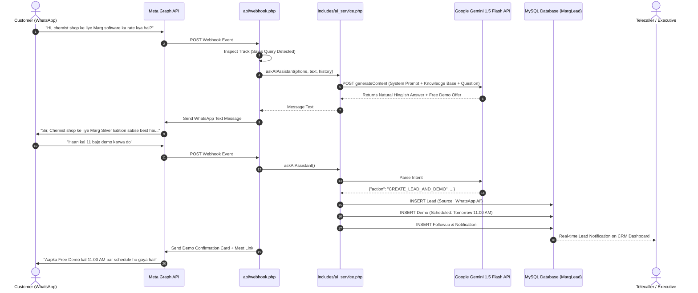

# System Architecture Document (ARCHITECTURE.MD)
## Project: MargLead CRM - WhatsApp AI Sales & Autonomous Lead Conversion Engine

---

## 1. High-Level Architecture Overview

The system operates as a hybrid webhook architecture layered directly on top of MargLead CRM's existing WhatsApp Business Cloud API integration.

```
+-----------------------------------------------------------------------------------+
|                           Meta WhatsApp Cloud API                                 |
+-----------------------------------------------------------------------------------+
                                      |  (POST Incoming Webhook Event)
                                      v
+-----------------------------------------------------------------------------------+
|                        Webhook Gateway (`api/webhook.php`)                        |
|                                                                                   |
|  1. Payload Signature Verification (X-Hub-Signature-256)                          |
|  2. User Session Context Inspector                                                |
+-----------------------------------------------------------------------------------+
                                      |
         +----------------------------+----------------------------+
         |                                                         |
         v                                                         v
[Track A: Support Pipeline]                               [Track B: AI Sales Pipeline]
- Button: "Support"                                       - Button: "Sales"
- Active Ticket Session                                   - Queries: Pricing, Features, Demo
- Team Member Ticket Triggers                             - General Software Questions
         |                                                         |
         v                                                         v
+------------------------------------+        +-------------------------------------+
| Existing Support Engine            |        | Centralized AI Service Engine       |
| - WhatsApp Flow: Create Ticket     |        | (`includes/ai_service.php`)         |
| - Notifications to Engineers       |        |                                     |
| - Resolution & Closure Alerts      |        | - Master Persona & Domain System    |
+------------------------------------+        | - Dynamic Knowledge Base (Settings) |
         |                                    | - Gemini 1.5/2.0 Flash Client       |
         |                                    | - Fallback Providers (OpenAI/Claude)|
         |                                    +-------------------------------------+
         |                                                         |
         |                                                         v
         |                                    +-------------------------------------+
         |                                    | Lead & Demo Intent Parser           |
         |                                    | - Detects Demo Agreements           |
         |                                    | - Extracts Name, Ed., Preferred Time|
         |                                    +-------------------------------------+
         |                                                         |
         +----------------------------+----------------------------+
                                      |
                                      v
+-----------------------------------------------------------------------------------+
|                            MargLead Database Layer (MySQL)                        |
|                                                                                   |
|  - `leads`: Auto-inserted with source='WhatsApp AI', status='new'                 |
|  - `demos`: Auto-inserted with status='scheduled', mode='Online'                  |
|  - `followups`: Auto-inserted pending activity linked to executive                |
|  - `timeline`: Activity trail audit log                                           |
|  - `system_settings`: Centralized AI keys, FAQs, and custom prompts               |
+-----------------------------------------------------------------------------------+
```

---

## 2. Component Specifications

### 2.1 Webhook Router (`api/webhook.php`)
* **Role:** Single ingress endpoint receiving incoming message events from Meta Graph API (`v20.0`).
* **Router Decision Matrix:**
  * If incoming payload contains `interactive.button_reply.id === 'btn_support'` &rarr; Routes to Support Handler.
  * If incoming payload contains `interactive.button_reply.id === 'btn_sales'` &rarr; Routes to AI Sales Handler.
  * If user state in `whatsapp_sessions` has an open support ticket creation workflow &rarr; Support Flow takes priority.
  * Default incoming text message (e.g. *"Marg pricing kya hai?"*, *"Demo book karo"*) &rarr; Routed to `askAIAssistant()`.

### 2.2 Centralized AI Service Adapter (`includes/ai_service.php`)
* **Design Pattern:** Strategy / Adapter Pattern.
* **Responsibilities:**
  * Abstraction over LLM providers:
    ```php
    function callAIService($prompt, $history = [], $systemPrompt = null): array
    ```
  * Loads active API credentials dynamically:
    1. Checks DB table `system_settings` (`ai_provider`, `ai_api_key`, `ai_model`).
    2. Falls back to environment / constant `GEMINI_API_KEY`.
  * Assembles conversational history payload.
  * Executes outbound HTTP request (cURL) with 5-second timeout and exponential backoff retry.
  * Parses response and extracts text output or structured action JSON.

### 2.3 Conversational Memory Manager
* **Session Cache:** Lightweight key-value table `ai_chat_sessions`:
  * `phone_number` (VARCHAR 20, Primary Key)
  * `conversation_history` (JSON: array of `{role: "user"|"model", text: "..."}`)
  * `last_interaction` (TIMESTAMP)
  * `lead_captured` (TINYINT 1)
* **TTL Policy:** Sessions expire after 24 hours of inactivity to reset context and save tokens.

### 2.4 Autonomous Lead Converter (`api/ai_lead_converter.php`)
* **Trigger:** When AI detects positive buying/demo signals, it returns an action block:
  ```json
  {
    "action": "CREATE_LEAD_AND_DEMO",
    "customer_name": "Sharma Medical Store",
    "product": "Marg Silver Pharma",
    "preferred_time": "2026-09-22 11:00:00",
    "city": "Kanpur",
    "remarks": "Inquired about expiry management and drug license billing"
  }
  ```
* **Database Operations (Atomic Transaction):**
  1. `INSERT INTO leads (id, name, company, phone, email, city, source, enq_for, status, assigned_to, created_at)`
  2. `INSERT INTO demos (id, lead_id, scheduled_at, mode, engineer, status)`
  3. `INSERT INTO followups (lead_id, action_type, scheduled_at, remarks, status)`
  4. `INSERT INTO timeline (lead_id, actor, action_taken)`
  5. `INSERT INTO notifications (user_id, role, title, message)`

---

## 3. Data Flow Sequence (Sales & Demo Capture)



---

## 4. Resilience & Fail-Safe Mechanisms
1. **AI API Outage / Timeout:** If Gemini or external AI fails to respond within 4.5 seconds, system defaults to an automated polite holding message:
   *"Dhanyawad! Hamare senior sales executive aapse jald hi WhatsApp par sampark karenge."*
2. **Rate Limit Handling:** Token bucket rate limiter prevents spam attacks from consuming API quotas.
3. **Database Integrity:** Foreign key checks and duplicate phone verification prevent duplicate lead clutter.
